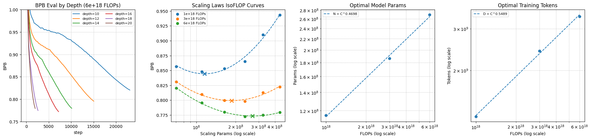

# Nanochat Repro

This repo is a from-scratch, by-hand reproduction of the pretraining stage of Andrej Karpathy [nanochat](https://github.com/karpathy/nanochat). It is built to understand training of LLMs from the ground up. This repo includes training scripts, GPT model, distributed AdamW/Muon, FP8 and some other tricks to bring performance on par with reference nanochat. I also reproduced scaling laws experiments.

Two extensions beyond original nanochat include:

**Logging Metrics**: To explore deeper training dynamics, with `--log-metrics` training run will generate additional local logs with data required to later construct RMS/norms plots of post-block activations, gradients and param updates, etc.

**Deterministic Validation**: Runs can be made bit-for-bit deterministic by using `--deterministic` flag. With small patch to Andrej nanochat, it is possible to match some of the runs bit-for-bit with Andrej nanochat. This was the main correctness test when developing this repo.

To more deeply internalize core concepts I wrote most of the code by hand. I used AI agents as educational resource and for code review, but not to edit code. In similar spirit I used `nanochat` for learning, and tried not to overuse it during coding.

I would like to deeply thank Andrej and everyone who supported him in building original `nanochat`. In my opinion, it is the best resource currently available for learning LLM training.

## Quick Run

```bash
uv sync
uv run python -m scripts.download_dataset -n 10
uv run python -m scripts.download_eval_bundle
uv run python -m scripts.train_tokenizer
uv run ./runs/train_d12.sh
```

The `-n 10` is good for quick test. Longest scaling run requires approx 230 shards. Inspect `train_d12.sh` to ensure correct values for `CUDA_VISIBLE_DEVICES` and `--nproc_per_node` param.


## Scaling Laws

This is a reproduction of Andrej [miniseries_v1](https://github.com/karpathy/nanochat/discussions/420). The objective is to find optimal token:param ratio for a given FLOPs budget, and then check if the ratio is roughly stable as training FLOPs increase. There is no way I can explain it better than Andrej so I will refer to his post. Notably Andrej post written using older `nanochat` commit, before multiple architecture changes and autoresearch optimizations. This reproduction uses this repo code which corresponds to more recent `nanochat`, so the values won't match exactly. The final sweep took approx 5h on 8xH200 SXM.



The **BPB Eval by Depth** plot show BPB eval for different runs at constant target FLOPs=6e18. As the model depth increases, to compensate, the number of training tokens is decreased. The total compute used (in estimated FLOPs) is held constant. The plot shows there is some optimum depth/param ratio to get best BPB eval.

The **Scaling Laws IsoFLOP Curves** plot shows all training runs together, grouped by target FLOPs budget. For each FLOPs budget, a quadratic fit is used to find optimal number of model params (marked as X). The optimal values are as follows:

```
FLOPS         Params           Tokens   Ratio      BPB
1e+18    115,399,278    1,274,356,943   11.04   0.8444
3e+18    186,137,098    2,420,658,667   13.00   0.7993
6e+18    269,470,252    3,385,658,171   12.56   0.7733
```

The compute-optimal ratio seems stable around 12-13, which corresponds to NanoChat default =12 in recent commits.

The plots **Optimal Model Params** and **Optimal Training Tokens** show linear fit (in log space) used to estimate `C` scaling factor for both training horizon `D` and model params `N`. We get:

```
log10(params) = 0.4698 * log10(flops) + -0.3996
log10(tokens) = 0.5489 * log10(flops) + -0.7693
optimal params = 10**-0.3996 * flops**0.4698
optimal tokens = 10**-0.7693 * flops**0.5489
```

Dropping constants, we get `D ∝ C^0.4698` and `N ∝ C^0.5489` which is close-ish to Andrej results `D ∝ C^0.5` and `N ∝ C^0.5`.

My conclusion is that sweep is broadly sane and valid. Having said that, optima are fitted with only six depths per FLOP budget, and minima are fairly flat around neighbouring depths, so I would urge not to overinterpret these results and treat them as approximate sanity check.
